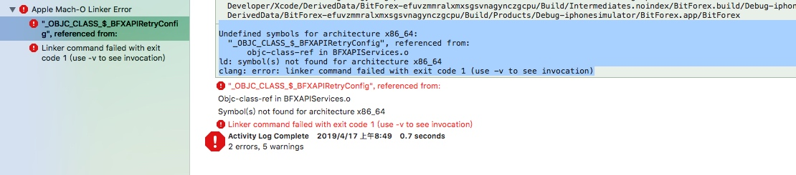

# 编译报错, _OBJC_CLASS_&_"CLASS",referenced from:
 
 
##报错原因
 
 某个 Class 只有声明, 没有实现, 并且使用了它, 导致编译器报错。
 
 
** 报错信息: **

Undefined symbols for architecture x86_64:
  "_OBJC_CLASS_$_BFXAPIRetryConfig", referenced from:
      objc-class-ref in BFXAPIServices.o
ld: symbol(s) not found for architecture x86_64
clang: error: linker command failed with exit code 1 (use -v to see invocation)

 
 

