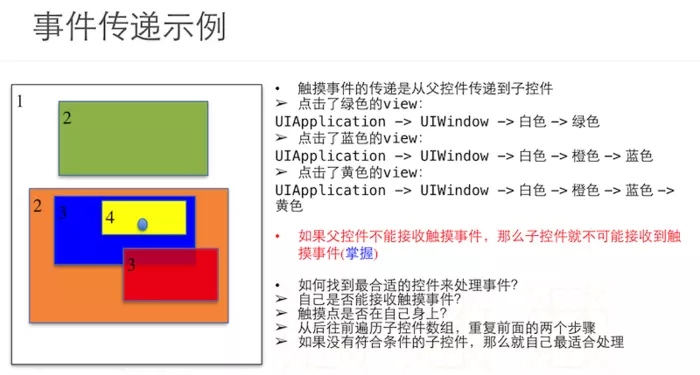
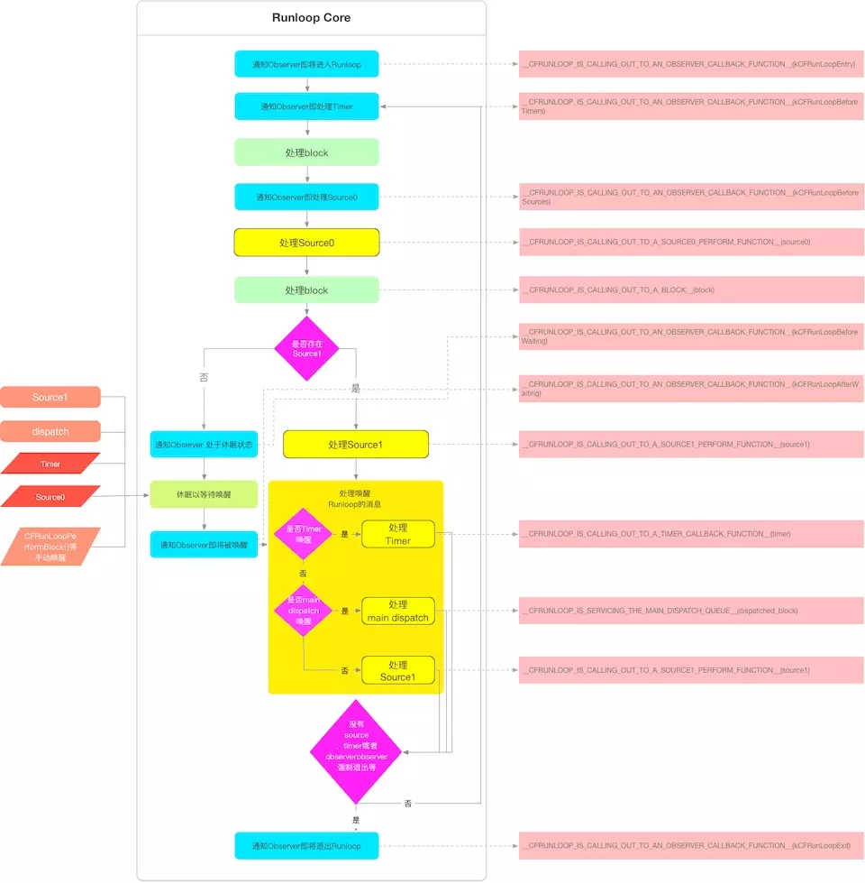
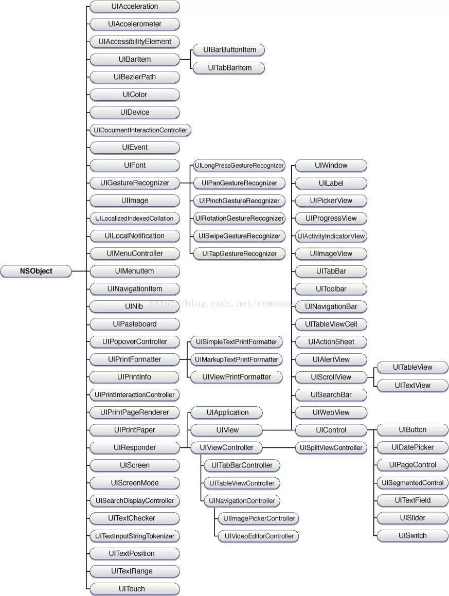

# 掘金 iOS
参考:[iOS面试珠玑](https://juejin.im/post/5b03936a6fb9a07ac162bfe0)
## 一、简述iOS中的内存管理方式
1. iOS 使用的是引用计数器作为内存管理机制, 分别使用过两种不同的内存管理手段, 早期使用的是 MRC(手动内存管理), 直到 iOS 5 推出新特征 ARC（自动内存管理）。
2. 使用 MRC 管理内存, 主要通过关键之 retain, release。 来对对象进行 引用计数器 +1, -1 的操作。 当对象引用计数器为0 时, 被系统自动回收。 MRC 相关的内存管理关键字还有 autorelease, retainCount, dealloc。  MRC 内存管理关键字只是针对 OC 对象, 如果是 C 生成的内存指针, 还需要使用其相应 关键字去进行释放。 free。
3. 使用 ARC 管理内存, 其管理的原理也是个 MRC 没有太大的区别, 其同理也是通过 retain, release 来对引用计数器进行  + -。 不过这些工作都交给了编译器, 编译器在合适的时机 自动帮我们添加上内存管理关键字去进行内存操作。 我们需要注意的是 防止循环引用。
4. 内存管理属性对应关键字, weak、strong、assign、copy、retain、unsafe_unretained。 其主要是在对象 set get 方法中执行的内存管理操作方法不同。从而使管理内存对象有不同的方式。
## 二、block的分类，__block的作用，block循环引用的产生原因及解决办法
*分类*
* 全局
* 堆
* 栈

*作用*
* 反向传值。
* 回调、类似委托代理。

*产生原因及解决方法*
* 当一个类内存持有 **block** 时,又在其内存实现里面调用了 **self**, 相当于此 **block** 也持有自己。形成环形引用, 最终导致 **block**和 **self** 都无法正常被释放。
* 此时可以在外部将 **self** 使用 __weak 修饰,在内部调用的时候防止其 修饰的弱引用被释放掉, 在使用 __strong 来修饰调用即可。

## 三、深拷贝与浅拷贝

简要概括：
深拷贝是对内容的复制、生成一份新的指针指向该内容。
浅拷贝则是对指针的复制、内容不变。

其对应的方法分别是 copy、mutableCopy。 对象与可变对象分别执行这两个方法时,最终产生结果也会不相同。

copy: 针对不可变对象使用时, 最终结果都是浅拷贝。针对可变对象使用时, 最终结果则是深拷贝。
mutableCopy: 针对可变不可变对象执行结果都是 深拷贝。

## 四、iOS中常见修饰属性和默认的对象属性关键字。
**常见**
atomic,nonatomic,weak,strong,assign,retain,copy,unsafe_unretained,readonly,readwrite,getter==,setter==。

不同的关键字修饰属性主要作用都是在于 set get 方法系统会对其内部实现采用不同的方法执行。

**属性意义**

* atomic: 原子性的, 其是内存安全的,但并非真正的安全, 因为针对不同线程在执行 set get 方法时, 并不能真正有效的保证其值是不变的。 所以为了避免占用内存开销,一般很少使用这个关键字修饰。
* nonatomic: 非原子性的, 无法保证变量访问的线程安全性, 但是执行效率相对会比 atomic高很多。
* weak: 针对 OC 对象内存管理修饰符号, 其不会使对象的内存计数器 +1。 一般在委托协议中的代理中为了防止循环引用 经常会使用其来修饰。 当对象 retainAcount 为 0 时, 其释放之后, 指针会自动指向 nil。 
* unsafe_unretained: 与 weak 类似, 使用该对象不会使其内存计数器 +1。 唯一区别是其当 引用计数器 == 0 时, 其不会指向 nil, 而是指向随机的内存地址, 即野指针。 不过其访问效率相对 weak 会高。
* strong: 即强引用 与 weak 相反, 使用该对象则会使其 内存计数器 +1。
* assign: 其与 weak 有异曲同工之妙, 只是简单的内容赋值, 使用该 变量不会使其引用计数器 +1。  主要是针对 C 数据类型。
* retain: 与 strong 同理, 用于修饰 OC 对象。 除非是在 block 里面则相反,一般情况下等同于ARC环境下的strong修饰符，但是在修饰block对象时，retain相当于assign，而strong相当于copy。
* copy: 主要用于 不可变字符串, 数组, 字典 block数据类型。 即在进行 set 方法时, 对新的值 进行 copy 方法。 将结果返回到当前对象中。
* readonly: 只读属性。
* readwrite: 可读可写。
* setter == 修改 setter 方法,  需要重写, 否则访问报错。
* getter == 修改 getter 方法,  同理。

## 五、那些属性需要声明成 copy, 为什么

例如:  NSString, NSArray, NSDictionary, block 等。

因为前三个 OC 对象都有与之像对应的 MutableObject,  所以其本意为 不可变对象, 假定一个 NSString 属性使用 strong 来进行修饰, 然后在编写代码过程中传入了一个 NSMutableString,  因为得到的结果肯定是 深拷贝, 产生一个新的对象。  最终我们对原有的 NSMuableString 进行修改时, 发现现有的 NSString 也会跟变化。  原有就是使用 copy 修饰时, 对原有对象进行赋值时, 最终都会得到 一个 NSString。  而 Strong 则会得到一个 NSMutbleString。

## 六、通知，代理，block，KVO的使用场景分别是什么，有什么区别？

* 通知: 属于一对多的传递方式。 适合用于解耦, 当两个不关联的页面需要相互通讯的时候, 可以采用 其来完成。 还有需要监听系统状态做出相应回应的时候 也可以采用其来完成。 对于 iOS 8.3 前添加通知之后 必须要在生命周期结束的时候 进行删除通知,  否则当在次发出此通知时, 导致Crash,  因为当系统再次发出此通知的时候, 会到添加通知人发送相应方法, 但是次对象已经释放, 相当于向 nil 或者 野指针 发送消息 导致异常崩溃。
  所以我们在对象生命周期结束前, 必须要手动调用 删除掉相应的通知。  但是在 iOS 8.3 系统以上不需要再手动删除了, 系统已经在类的 dealloc 方法中自动移除。
  
  
  * 代理: 属于一对一的传递方式。通过 @protocal 协议来完成, 在声明 @protocal 定义相应的 delegate 以及相应的 Method, 然后委托相应的 delegate 来实现 Method。 主要应用在 正反向传值, 生成 UITableView, UICollectionView 等视图中都必修要使用到。对外提供相应接口实现等。  其具有清晰简洁的表达方式, 又适用于多种应用场景。   
  * block: 类似代理, 效率会比代理要高一点。但是在使用过程中要注意内存泄漏的问题、  一般系统对 block 的使用基本都是 针对类方法。 这样就能真正有效得避免了 内存泄漏的问题。
    UIView 的动画方法。 
  * KVO: 可以一对多, 也可一对一。  一般适用于监听某个实例的属性。  例如监听 UIScrollView 的 contentOffset,  UIWebView 加载速度, AVPlayer 播放进度等等。

## 七、简述对OC中的isa指针的认识

## 八、 Objective-C 消息转发机制

* 由 obje_msgSend 方法调用, 当其找不到接收者时, 会依次对

## 九、响应链原理

* 由系统最顶层依次转发到其子视图, 直到找到响应的子View。  主要又 Runloop 完成。
* 当用户触摸到屏幕时,触碰屏幕产生事件 UIEvent 并存入 Application 中的事件队列中。 具体传递过程为  Application --- > UIWindon ---> UIViewController ---> VC.view ---> VC.view.subViews[...]
* 涉及到的方法分别有


 ``` objective-c
 // 判断当前触屏到的响应者在哪个 View 上
 -(UIView*)hitTest:(CGPoint)point withEvent:(UIEvent\*)event; 
//判断当前点击是否在控件的Bounds之内
  -(Bool)pointInside:(CGPoint) WithEvent:(UIEvent *)event;  
  
```  

##十、手写 block 结构声明、
1. 属性声明： 
``` 
@property(nonatomic, copy)void (^executePalyBlock)(NSInteger money);
```
2. 类型定义
```
typedef void (^executePlayBlock)(NSInteger money);
```

## 十一、Runloop原理, Runloop与线程关系。
Runloop 即不断循环运行机制。
其和线程是一一对应的, 每一个线程都会有相应的 Runloop 在协助运行着, 当应用程序启动时, 进入到 Main 函数中就会启动相应的Runloop 循环监听系统事件。
应用场景: 在 UITableView 中多行 Cell 启动多个 timer.  如果使用默认 代码生成的 timer 进行调用, 则当 视图发生滚动的时候, timer 运行就会被干扰, 因为默认创建的 timer 会被加入到 主线程 Runloop 上去, 其模式是默认模式, 然而视图滚动的时候, 是由另一个 模式的 Runloop 监听执行的, 此时当前 Runloop 与 时钟的 Runloop 不对应,  定时器的运行就会受到干扰。  
解决方法有两种, 把 timer 分别假如到不同的线程去运行。
把创建的 timer 分别添加到 滚动模型的 Runloop 模型上去。


## 十二、	GCD与NSOperation两种管理多线程方式的异同点
## 十三、	GCD的常用api
## 十四、GCD中的同步异步，串行并发的概念，GCD常见的线程死锁问题
## 十五、iOS 中常用的线程锁有哪些，分别具有什么特点。
## 十六、NSStringFromClass()
此方法传入相应 类名 即可返回返回当前类对应 NSString。
一般使用 Xib 创建实例类的时候应用, 还有需要打印类名等等。
## 十七、KVO 的原理
首先以 一个音乐播放器为例子。  在VC中 展示播放器, 有歌曲进度条。   progressView进度条 和 timerClass 歌曲类   我想通过 progressView 实时展示歌曲的播放进度。 那么我可以通过 VC 调用   -(void)addObserver:(NSObject *)observer forKeyPath:(NSString *)keyPath options:(NSKeyValueObservingOptions)options context:(nullable void*)context  方法去监听 歌曲实例里面的播放时间 Key。  监听之后 系统通过 Runtime 生成一个 伪装类 WtimerClass. 通过 [timer Class] 得到, 然后实际上我们监听的是这个类 相应的 Key,  系统会在这个类的 set 方法里面 添加两个方法, *willkeyChangeValueForkey:* *didkeyChangeValueForKey:* 调用时机分别在 赋值的前后。 进而在去调用 - (void)observeValueForKeyPath:(NSString *)keyPath ofObject:(id)object change:(NSDictionary<NSKeyValueChangeKey,id> *)change context:(void *)context;    其是一个委托方法来着。 系统已经在类内存遵守了相应的协议。 然后在值发生改变前后让代理去调用此协议方法。

## 十八、runtime 的机制和应用场景。
应用场景:
1. **类方法交换**,  如通过 系统原有方法交换来添加一些新特性, 还有在系统类中 增加埋点统计功能,  也可以通过交换系统 控件类方法来添加统计功能。   主要实现 通过 objc/runtime.h 文件 里面的通过 method_exchangeImplementations(<#Method  _Nonnull m1#>,<#Method  _Nonnull m2#>),  参数一传入 原方法, 参数二传入要交换的方法.  获取方法通过 class_getInstanceMethod(Class _Nullable cls, SEL _Nonnull name) 得到. 
2. **分类添加属性**.
3. **遍历类属性,方法等**.
4. **模型与字典的转换**.

## 十九、MJExtension, MJRefresh, SDWebImage的实现原理
## 二十、NSTimer 计时准确吗？ 为什么。
如果 NSTimer 直接在主线程创建使用是不够准确的。
由于 NSTimer 在主线程中创建 默认使用的也是 主线程对应的 Runloop, 如果当前 Runloop 在检测定时器期间, 遇到其他事件阻塞做了耗时的操作, 并且超过了间隔的时间, 则会影响到定时器的下一次任务执行。
## 二十一、类的分类和类的扩展的区别,类的分类的实现原理
**区别:**
*分类在编译时在可添加方法，不可直接添加属性。
*扩展在编译期间可直接添加属性。 
*分类可使用运行时添加相应的属性。
　　　　　
**分类原理:**
编译结束之后, 在运行时期间,会在去检查类是否存在分类,如果存在分类,则会去检测分类里面的方法,然后将分类的方法直接插入到obje_class 结构体里面的 mothedLists 数组的第一个下标下。所以如果有分类的方法和本类的方法同名时, 分类的方法会直接覆盖掉本类的方法, 运行期间会检查本类所有分类, 并且如果检查到之后会依次将每个方法添加到obje_class 结构体中的 mothedLists 里面。那么最后一个被加载进 compile　sources 的类的分类文件中的方法将会覆盖其他同名方法名。　　　

## 二十二、iOS动态关联属性的原理
## 二十三、Masonry的抗压缩属性和抗拉伸属性
## 二十四、加密的种类、对称加密与非对称加密
**对称算法:**  MD5,AES,DES。
**非对称算法:** RSA。
**区别:** 对称加密采用的是同一个秘钥进行加密,解密。 其是计算最快速,简单的一种加密方式,但是安全性相对偏低。 如在网络传输中一旦秘钥被拦截即很容易破解。 
　　　非对称加密采用的是加密和解密都是不同的秘钥一个公钥和一个私钥,RSA 算法在当前算是最为安全的一种算法, 算法也是不可逆的, 一般网络传输只需要将公钥传递到出去,私钥保存在本地即可。    

## 二十五、解释一下七层网络协议,三次握手和四次挥手
**七层网络协议:** 物理层、数据连接层、网络层、传输层、表示层、会话层、应用层。  链路层 ---> ip ---> TCP/UDP ---> HTTP/HTTPS ---> 

**三次握手:** 
1. 客户端发送SYN包到服务器, 并且进入SYN_SEND状态,等待服务器确认,SYN:同步序列编号（Synchronize Sequence Numbers）。
2. 服务器收到SYN包,确认客户的SYN,同时自己也发送一个SYN+ACK包。并且服务进入SYN_RECV 状态。
3. 客户端接收SYN+ACK包,继续向服务器发送确认包ACK,此包发送完毕,客户端与服务端建立TCP/UDP连接,服务器和客户端都进入ESTABLISHED状态。 三次握手建立连接完毕。
**四次挥手:**
1. 客户端

## 二十六、http和https的区别

## 二十七、https双向验证原理

## 二十八、HTTP常用的头部字段，常见的返回状态码和意义
## 二十九、@class和@import以及include的区别
@class 只是声明文件, 告诉编译器该类可以使用这个类名文件。编译速度相对 import 要快.
@import 是直接引入整个文件。
@include 和 import 作用类似, 都是引入整个文件, 但是 import 相对 include　多了一层宏定义, 可有效方式文件重复引用问题。
使用include 引入文件产生重复引用的问题原理, 比如 A 类 B 类 引用了 C类, 然后 D 类 引用 A B 类, 这样就相当于 D 类引用了 2次 C类。造成重复引用。   import  通过系统宏定义将这个问题解决。 在使用 import 引入文件时, 其会先判断是否 以引用此类 文件, 如果已有就不在 引用。 否则将其引用。
## 三十、  weak对象的管理方式
weak 是弱引用, 使用此关键字修饰不会使对象引用计数器 +1. 
当对象的引用计数器为0释放时, 该对象指针会直接指向 nil。
相对unsafe_unretained 对象释放之后直接指向野指针, 相对更安全一点。 不过效率没有它高。
## 三十一、iOS的retain和release的操作是在编译期还是运行时进行的
此代码都是在编译器在编译期间自动添加到 Setter 方法里面的。
## 三十二、+(void)load方法和+(void)initial方法的异同
**相同点:** 
1. 调用一次。
**不同点:**
1. load 方法是在编译期间就进行的调用, 根据 Compile Sources 各个类文件依次调用,先调用其超类,然后在去检查子类是否有实现 load 方法,实现的话依次往下调用。   使用场景：方法交换
2. initial 方法是类似懒加载一样, 其是在程序运行期间, 当类第一次接收到消息的时候, 首先就会去调用这个方法。 这个方法是可以确保线程安全的. 所以一般在这个方法里面经常初始化一些数据。   其调用顺序也是一样, 当本类收到消息时 会先调用父类 initial 方法. 然后依次调用子类的. 如果子类没有实现这个方法的话, 则会多次调用 父类 initial 方法。所以我们可以在父类的 initial 重写加一层逻辑。
load使用示例1, 见 @sunnyxx 大神的博客 [Notification Once](http://blog.sunnyxx.com/2015/03/09/notification-once/), 用于给 AppDelegate 瘦身。
load使用示例2, 见博客 [Method Swizzling 和 AOP 实践](http://tech.glowing.com/cn/method-swizzling-aop/), 在UIViewController的 +load 时期执行IMP替换，实现AOP。

## 三十三、UIViewController的生命周期方法调用顺序
1. alloc 创建对象,分配内存。
2. init  初始化对象,初始化数据.
3. loadView 检测是否存在Xib 文件,如果有则加载Xib 文件.
4. viewWillLayoutSubviewS. 视图进行布局之前
5. viewDidLayoutSubviewS. 视图已经进行布局。
6. viewDidload. 视图载入完成。
7. viewWillAppear 视图将要出现在屏幕前。
8. viewDidAppera 视图已经出现在屏幕上。
9. 视图销毁则、 ViewWilldisappear   视图将要被移除
10. viewDidDisappear  视图已经被移除。
11. dealloc 销毁视图。
## 三十四、iOS中各类控件的继承树关系

##三十六、管理第三方 SDK, Cocoapod 特点与  Carthage 的区别。

##三十七、-(BOOL)isKindOfClass和-(BOOL)isMemberOfClass的区别
iskindOfClass 判断比较的类是否是这个类或者子类的实例。
isMemberofClass 判断比较的类是否属于当前类实例。

##三十八、数据持久化的几种方式和对应的应用场景
1. Plist 文件, 即创建应用就自带的一个文件。此文件
2. preference(偏好设置)也就是 NSUserDefaults 类。 存储一些小型数据,参数,用户偏好设置, 等等.
3. NSKeyedArchiver 归档,专门存储一些不需要增删查改的数据, 主要是字典和NSObject等、 存储的对象一定要遵循NSCoder和NSDecoder协议。
4. SQLite 3: 存储一些设计增删查改的数据。
5. CoreData: 效率高,存储需要增删查改 并且体积较大的数据。


　　　 

　　　　      


  
  
  
  
  
  
  
  
 
  


 
 


 


